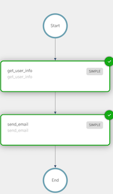

# Javascript QuickStart Example
This repository contains sample applications that demonstrates the various features of Conductor Javascript SDK.

## SDK Features
C# SDK for Conductor allows you to:
1. Create workflow using Code
2. Execute workflows
3. Create workers for task execution and framework (TaskRunner) for executing workers and communicating with the server.
4. Support for all the APIs such as
    1. Managing tasks (poll, update etc.),
    2. Managing workflows (start, pause, resume, terminate, get status, search etc.)
    3. Create and update workflow and task metadata
    4. User and event management

### Running Example

> **Note**
Obtain KEY and SECRET from the playground or your Conductor server. [Quick tutorial for playground](https://orkes.io/content/docs/getting-started/concepts/access-control-applications#access-keys)

Export variables
```shell
export KEY=
export SECRET=
export CONDUCTOR_SERVER_URL=https://play.orkes.io/api
```

Run the main program
```shell
npm install
node src/main.js
```

## Workflow

We create a simple 2-step workflow that fetches the user details and sends an email.

<table><tr><th>Visual</th><th>Code</th></tr>
<tr>
<td width="50%"></td>
<td>
<pre>

wf = workflow("user_notification", [
  createGetUserDetailsTask(),
  createEmailOrSmsTask()
]);

const createGetUserDetailsTask = () => {
  return simpleTask("get_user_info", "get_user_info", {
    userId: "${workflow.input.userId}",
  });
}

const createEmailOrSmsTask = () => {
  return switchTask("emailorsms", "${workflow.input.notificationPref}", {
    email: [
      simpleTask("send_email", "send_email", {
        email: "${get_user_info.output.email}",
      }),
    ]
    sms: [
      simpleTask("send_sms", "send_sms", {
        phoneNumber: "${get_user_info.output.phoneNumber}",
      })
    ],
  });
}

</pre>
</td>
</tr>
</table>

## Worker

Workers are implemented as simple functions with sample implementation.  
See [workers.js](src/worker/workers.js) for details.

## Executing Workflows

There are two ways to execute a workflow:

1. Synchronously - useful for short duration workflows that completes within a few second.
2. Asynchronously - workflows that runs for longer period

### Asynchronous Workflow Execution

```javascript
WorkflowExecutor#startWorkflow(...)
```

See [main.js](src/main.js) for complete code sample of workflow execution.
